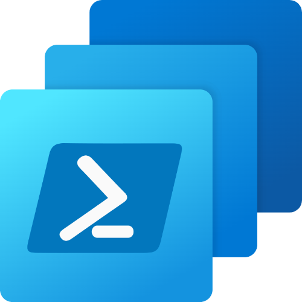

<div align="center">



# PSCloudPC

**Manage Windows 365 Cloud PCs from PowerShell.**

A community-driven PowerShell module for Windows 365, built on Microsoft Graph. Automate provisioning, images, networking, user settings and day-to-day Cloud PC operations.

[](https://www.powershellgallery.com/packages/PSCloudPC)
[](https://www.powershellgallery.com/packages/PSCloudPC)
[](https://github.com/Windows365Management/PSCloudPC/actions/workflows/UnitTests.yml)
[](https://learn.microsoft.com/powershell/scripting/install/installing-powershell)
[](LICENSE)

[Documentation](https://pscloudpc.com) ·
[Getting started](#getting-started) ·
[Cmdlets](#cmdlets) ·
[Contributing](CONTRIBUTING.md) ·
[Changelog](CHANGELOG.md) ·
[Discussions](https://github.com/Windows365Management/PSCloudPC/discussions)

</div>

---

## Why PSCloudPC?

The Windows 365 Graph API is powerful, but working with it directly means handling tokens, paging, beta endpoints and JSON payloads yourself. PSCloudPC wraps all of that in consistent, pipeline-friendly cmdlets so you can:

- **Automate the full lifecycle**: provisioning policies, user settings, custom images and Azure network connections.
- **Run remote actions at scale**: reboot, rename, resize, restore, reprovision, snapshot and troubleshoot Cloud PCs.
- **Operate Frontline Cloud PCs**: power on and power off shared and dedicated Frontline devices.
- **Gain visibility**: audit events, connectivity history, real-time connection status and remote action results.
- **Move configuration between tenants**: export and import provisioning policies as JSON.
- **Authenticate your way**: interactive, device code, client secret, certificate or a bring-your-own access token.

## Getting started

### Requirements

- PowerShell **7.2 or later** on Windows, macOS or Linux
- The `Microsoft.Graph.Authentication` module (installed automatically as a dependency)
- A Windows 365 tenant and an account or app registration with the [required permissions](#permissions)

### Install

```powershell
Install-Module -Name PSCloudPC -Scope CurrentUser
```

To update to the latest release:

```powershell
Update-Module -Name PSCloudPC
```

### Quick start

```powershell
# Sign in interactively
Connect-Windows365

# List all Cloud PCs
Get-CloudPC

# Find a specific Cloud PC and reboot it
Get-CloudPC -Name "CPC-jdoe-XXXX"
Invoke-CPCReboot -Name "CPC-jdoe-XXXX"

# Back up a provisioning policy to JSON
Export-CPCProvisioningPolicy -Name "Corporate Enterprise" -OutputFolder "C:\Backups"

# Disconnect when you're done
Disconnect-Windows365
```

Every cmdlet ships with full comment-based help:

```powershell
Get-Command -Module PSCloudPC
Get-Help Get-CloudPC -Full
```

## Authentication

`Connect-Windows365` supports five authentication methods.

| Method | Example | Best for |
|---|---|---|
| Interactive | `Connect-Windows365` | Admins working at their own machine |
| Device code | `Connect-Windows365 -DeviceCode` | Remote shells and machines without a browser |
| Client secret | `Connect-Windows365 -TenantID contoso.onmicrosoft.com -ClientID <app-id> -ClientSecret <secret>` | Automation and scheduled jobs |
| Client certificate | `Connect-Windows365 -TenantID contoso.onmicrosoft.com -ClientID <app-id> -ClientCertificate $cert` | Automation without storing secrets |
| Access token | `Connect-Windows365 -Token $accessToken` | Reusing a token from another tool or pipeline |

For certificate authentication, pass an `X509Certificate2` object that includes the private key. `Get-PfxCertificate` loads one from a `.pfx` file on Windows, Linux and macOS, and asks for the password unless you pass `-Password`:

```powershell
$cert = Get-PfxCertificate -FilePath ./app.pfx
Connect-Windows365 -TenantID contoso.onmicrosoft.com -ClientID <app-id> -ClientCertificate $cert
```

### Permissions

Grant the following Microsoft Graph permissions: delegated permissions for interactive and device code sign-in, application permissions for an app registration.

| Permission | Used for |
|---|---|
| `CloudPC.ReadWrite.All` | Cloud PCs, policies, images, network connections and remote actions |
| `DeviceManagementConfiguration.ReadWrite.All` | Policy assignments and configuration |
| `DeviceManagementManagedDevices.ReadWrite.All` | Managed device operations |
| `Directory.Read.All` | Resolving users and groups |

> [!NOTE]
> Many Windows 365 features are only available on the Microsoft Graph **beta** endpoint. PSCloudPC uses beta where needed, so behaviour can change when Microsoft updates the API. If something breaks, please [open an issue](https://github.com/Windows365Management/PSCloudPC/issues/new/choose).

## Cmdlets

Detailed documentation for every cmdlet is available at **[pscloudpc.com](https://pscloudpc.com)** and through `Get-Help`.

<details open>
<summary><strong>Connection</strong></summary>

| Cmdlet | Description |
|---|---|
| `Connect-Windows365` | Connect to Windows 365 through Microsoft Graph |
| `Disconnect-Windows365` | Disconnect and clear the token cache |

</details>

<details open>
<summary><strong>Cloud PCs and remote actions</strong></summary>

| Cmdlet | Description |
|---|---|
| `Get-CloudPC` | List all Cloud PCs or find one by name |
| `Invoke-CPCReboot` | Reboot a Cloud PC |
| `Invoke-CPCRename` | Rename a Cloud PC |
| `Invoke-CPCResize` | Resize a Cloud PC to a different service plan |
| `Invoke-CPCRestore` | Restore a Cloud PC to a restore point |
| `Invoke-CPCReprovision` | Reprovision a Cloud PC |
| `Invoke-CPCCreateSnapshot` | Create an on-demand snapshot |
| `Invoke-CPCTroubleshoot` | Run a troubleshoot action on a Cloud PC |
| `Invoke-CPCEndGracePeriod` | End the grace period of a Cloud PC |
| `Invoke-CPCChangeUserAccountType` | Change the local account type of the Cloud PC user |
| `Invoke-CPCRetryPartnerAgentInstallation` | Retry failed partner agent installations |
| `Invoke-CPCPowerOn` | Power on a Windows 365 Frontline Cloud PC |
| `Invoke-CPCPowerOff` | Power off a Windows 365 Frontline Cloud PC |
| `Get-CPCRestorePoint` | List the restore points of a Cloud PC |

</details>

<details open>
<summary><strong>Monitoring and reporting</strong></summary>

| Cmdlet | Description |
|---|---|
| `Get-CPCAuditEvent` | List Windows 365 audit events |
| `Get-CPCConnectivityHistory` | Get the connectivity history of a Cloud PC |
| `Get-CPCRealTimeConnectionStatus` | Get the live connection status of a Cloud PC |
| `Get-CPCRemoteActionResult` | Get the results of remote actions on a Cloud PC |

</details>

<details open>
<summary><strong>Provisioning policies</strong></summary>

| Cmdlet | Description |
|---|---|
| `Get-CPCProvisioningPolicy` | List provisioning policies or find one by name |
| `New-CPCProvisioningPolicy` | Create a provisioning policy |
| `Update-CPCProvisioningPolicy` | Update a provisioning policy |
| `Remove-CPCProvisioningPolicy` | Remove a provisioning policy |
| `Set-CPCProvisioningPolicyAssignment` | Assign a provisioning policy to a group |
| `Export-CPCProvisioningPolicy` | Export a provisioning policy to JSON |
| `Import-CPCProvisioningPolicy` | Import a provisioning policy from JSON |

</details>

<details open>
<summary><strong>User settings policies</strong></summary>

| Cmdlet | Description |
|---|---|
| `Get-CPCUserSettingsPolicy` | List user settings policies or find one by name |
| `New-CPCUserSettingsPolicy` | Create a user settings policy |
| `Update-CPCUserSettingsPolicy` | Update a user settings policy |
| `Remove-CPCUserSettingsPolicy` | Remove a user settings policy |
| `Set-CPCUserSettingsPolicyAssignment` | Assign a user settings policy to a group |
| `Set-CPCCrossRegionDisasterRecovery` | Configure cross-region disaster recovery on a user settings policy |

</details>

<details open>
<summary><strong>Images</strong></summary>

| Cmdlet | Description |
|---|---|
| `Get-CPCGalleryImage` | List Microsoft gallery images |
| `Get-CPCCustomImage` | List custom images or find one by name |
| `New-CPCCustomImage` | Upload a new custom image |
| `Remove-CPCCustomImage` | Remove a custom image |

</details>

<details open>
<summary><strong>Azure network connections</strong></summary>

| Cmdlet | Description |
|---|---|
| `Get-CPCAzureNetworkConnection` | List Azure network connections or find one by name |
| `New-CPCAzureNetworkConnection` | Create an Azure network connection |
| `Update-CPCAzureNetworkConnection` | Update an Azure network connection |
| `Remove-CPCAzureNetworkConnection` | Remove an Azure network connection |

</details>

<details open>
<summary><strong>Cloud Apps</strong></summary>

| Cmdlet | Description |
|---|---|
| `Get-CloudApp` | List Cloud Apps or find one by name |
| `Invoke-CPCPublishCloudApp` | Publish a Cloud App to users |
| `Invoke-CPCUnpublishCloudApp` | Unpublish a Cloud App |

</details>

<details open>
<summary><strong>Tenant settings and reference data</strong></summary>

| Cmdlet | Description |
|---|---|
| `Get-CPCOrganizationSetting` | Get the Windows 365 organization settings |
| `Update-CPCOrganizationSetting` | Update the Windows 365 organization settings |
| `Get-CPCServicePlan` | List available Windows 365 service plans |
| `Get-CPCSupportedRegion` | List supported regions |

</details>

## Contributing

PSCloudPC is built by and for the Windows 365 community, and contributions of every size are welcome: bug reports, feature ideas, documentation fixes and new cmdlets.

- **Found a bug?** [Open a bug report](https://github.com/Windows365Management/PSCloudPC/issues/new?template=BUG_REPORT.yml)
- **Missing a feature?** [Request a feature](https://github.com/Windows365Management/PSCloudPC/issues/new?template=FEATURE.yml)
- **Have a question or an idea?** [Start a discussion](https://github.com/Windows365Management/PSCloudPC/discussions)
- **Want to write code?** Read the [contributing guide](CONTRIBUTING.md) to get set up, and look for issues labelled [`good first issue`](https://github.com/Windows365Management/PSCloudPC/labels/good%20first%20issue) or [`help wanted`](https://github.com/Windows365Management/PSCloudPC/labels/help%20wanted).

Please follow our [Code of Conduct](CODE_OF_CONDUCT.md) in all project spaces.

### Contributors

Thanks to everyone who has contributed to PSCloudPC.

<a href="https://github.com/Windows365Management/PSCloudPC/graphs/contributors">
  
</a>

## Security

Please do not report security vulnerabilities through public issues. See [SECURITY.md](SECURITY.md) for how to report them privately.

## License

PSCloudPC is released under the [MIT License](LICENSE).

---

<sub>PSCloudPC is a community project and is not affiliated with, endorsed by or supported by Microsoft. Windows 365 and Microsoft Graph are trademarks of the Microsoft group of companies.</sub>
